<h1 align="center">designtakt web framework</h1>

  <a href="PRINCIPLES.md">Principles</a> |
  <a href="MOTION.md">Motion</a> |
  <a href="stacks/astro.md">Astro</a> |
  <a href="stacks/astro-sanity.md">Astro + Sanity</a> |
  <a href="stacks/astro-supabase.md">Astro + Supabase</a> |
  <a href="stacks/next-sanity.md">Next.js + Sanity</a> |
  <a href="stacks/next-supabase.md">Next.js + Supabase</a> |
  <a href="LICENSE">License</a> |
  <a href="https://github.com/patrick-dt/art-of-web/issues">Issues</a>

  
  

Shared **web development principles** and a **pre-launch checklist**, with stack-specific addenda for Astro, Sanity, and Supabase.

## Structure

```mermaid
flowchart TD
  core[PRINCIPLES.md shared core]
  motion[MOTION.md catalog]
  motionRecipes[motion/ one file per pattern]
  checklistAll[Checklist: All projects]
  checklistCMS[Checklist: CMS]
  checklistSanity[Checklist: Sanity]
  checklistSupabase[Checklist: Supabase]
  checklistAstro[Checklist: Astro]
  checklistNext[Checklist: Next.js]
  astro[stacks/astro.md]
  astroSanity[stacks/astro-sanity.md]
  astroSupabase[stacks/astro-supabase.md]
  nextSanity[stacks/next-sanity.md]
  nextSupabase[stacks/next-supabase.md]
  core --> motion
  motion --> motionRecipes
  core --> checklistAll
  core --> checklistCMS
  core --> checklistSanity
  core --> checklistSupabase
  core --> checklistAstro
  core --> checklistNext
  core --> astro
  core --> astroSanity
  core --> astroSupabase
  core --> nextSanity
  core --> nextSupabase
  astro --> astroRules[Astro build rules]
  astroSanity --> asRules[Astro + Sanity rules]
  astroSupabase --> aspRules[Astro + Supabase rules]
  nextSanity --> nsRules[Next.js + Sanity rules]
  nextSupabase --> nspRules[Next.js + Supabase rules]
```

## What's in here

| File | Purpose |
|------|---------|
| [PRINCIPLES.md](PRINCIPLES.md) | Shared dev principles + layered pre-launch checklist |
| [MOTION.md](MOTION.md) | Motion catalog; recipes in [`motion/`](motion/) |
| [stacks/astro.md](stacks/astro.md) | Astro-only build rules |
| [stacks/astro-sanity.md](stacks/astro-sanity.md) | Astro + Sanity build rules |
| [stacks/astro-supabase.md](stacks/astro-supabase.md) | Astro + Supabase build rules |
| [stacks/next-sanity.md](stacks/next-sanity.md) | Next.js + Sanity build rules |
| [stacks/next-supabase.md](stacks/next-supabase.md) | Next.js + Supabase build rules |

**Shared dev principles** cover sizing, a11y, markup/layout, local preview (HMR on one `dev` server; agents must not spawn extras), interactions, CSS/Tailwind, and motion (CSS first, GSAP when needed). Motion recipes live in [MOTION.md](MOTION.md) and [`motion/`](motion/).

**References:** [Vercel Web Interface Guidelines](https://vercel.com/design/guidelines). Deeper interaction and form UX detail; we adopt the parts that fit client/marketing sites.

**Pre-launch checklist** is layered: walk **All projects** every time, then only the technology sections for your stack (CMS, Sanity, Supabase, Astro, or Next.js).

## How to use

1. Open [PRINCIPLES.md](PRINCIPLES.md) for shared build rules.
2. For motion recipes, open [MOTION.md](MOTION.md), then the pattern file in [`motion/`](motion/).
3. Pick your stack addendum for framework- and CMS-specific rules.
4. Before launch, walk the checklist: **All projects**, then the sections that match your stack.
5. Copy or adapt into your own projects; keep this repo as the shared baseline.

| Stack | Dev rules | Checklist sections |
|-------|-----------|-------------------|
| Astro only | [stacks/astro.md](stacks/astro.md) | All projects → Astro |
| Astro + Sanity | [stacks/astro-sanity.md](stacks/astro-sanity.md) | All projects → CMS → Sanity → Astro |
| Astro + Supabase | [stacks/astro-supabase.md](stacks/astro-supabase.md) | All projects → Supabase → Astro |
| Next.js + Sanity | [stacks/next-sanity.md](stacks/next-sanity.md) | All projects → CMS → Sanity → Next.js |
| Next.js + Supabase | [stacks/next-supabase.md](stacks/next-supabase.md) | All projects → Supabase → Next.js |

## Contribute

PRs and issues welcome.

- Keep wording short and plain English.
- Prefer checklist items that are clear pass/fail gates.
- Don't bloat with rare edge cases; open an issue first if unsure.
- One concern per PR when possible.
- Motion recipes: one file in `motion/`, one row in [MOTION.md](MOTION.md).

## License

[MIT](LICENSE)
